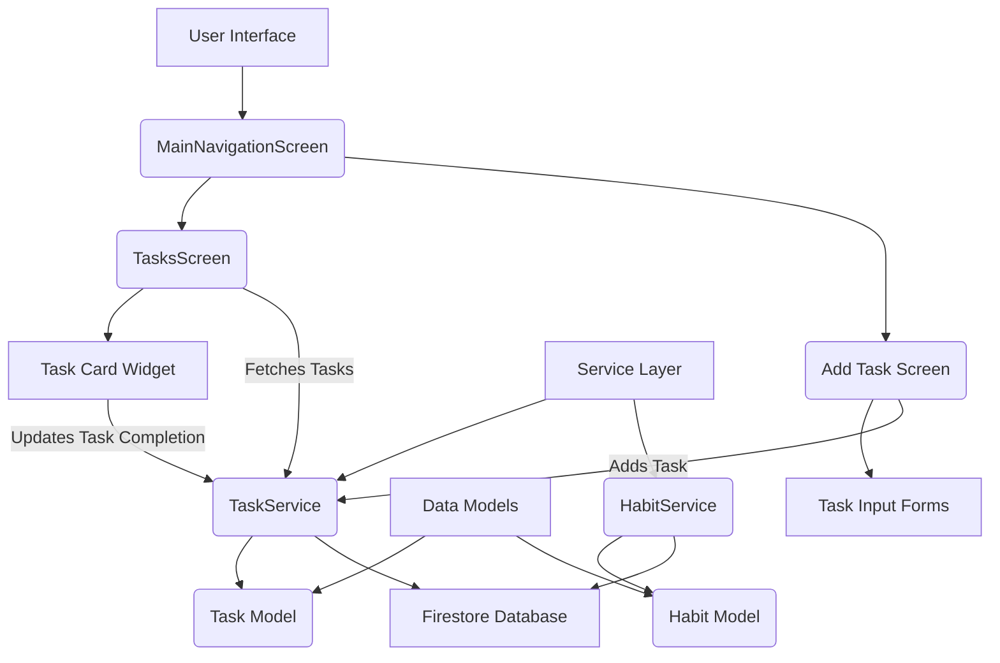

# Detailed Implementation Plan for "Add Task" Feature

This document outlines a detailed plan for implementing an "add task" feature within the existing application, focusing on UI/UX, Data Model, Service Layer, Integration Points, and Extensibility.

## 1. UI/UX Considerations

Based on the analysis of `HabitsScreen` and `TasksScreen`, the application uses a dark theme with vibrant accent colors (amber, cyan, pink). The layout often involves `Column` and `Row` widgets, `Padding`, `Container` with `BoxDecoration` for cards, and `SingleChildScrollView` for horizontal lists.

*   **"Add Task" Screen:**
    *   **Entry Point:** A Floating Action Button (FAB) on the `MainNavigationScreen` (which hosts `TasksScreen`) seems appropriate, similar to how new habits might be added.
    *   **Design:** The "Add Task" screen should follow the existing design language. It will likely be a new screen, similar to `AddHabitScreen`, accessible via `Navigator.push()`.
    *   **Input Fields:**
        *   **Task Title:** A `TextFormField` for the task name.
        *   **Description (Optional):** Another `TextFormField` for a brief description.
        *   **Task Type Selector:** Initially, this will be implicitly "Yes/No". For future extensibility, this could evolve into a dropdown or a set of radio buttons/chips to select different task types (e.g., "Yes/No", "Multiple Choice", "Numerical Input").
        *   **Category (Optional):** Similar to habits, a way to categorize tasks.
        *   **Reminder/Due Date (Optional):** Date and time pickers for setting a due date or reminder.
    *   **Action Button:** A prominent "Save Task" button at the bottom.
*   **Display of Tasks:**
    *   **`TasksScreen` Integration:** The `TasksScreen` currently shows "Sem tarefas pendentes" (No pending tasks). This area will be replaced by a `ListView.builder` or similar widget to display the list of tasks.
    *   **Task Card/Tile:** Each task should be represented by a card or tile, similar to the habit cards, displaying:
        *   Task Title
        *   Description (if available)
        *   A clear "Yes/No" completion mechanism (e.g., two buttons, or a single toggle that changes state).
        *   Due date/time (if set).
        *   Category (if set).
    *   **Completion Status:** The UI should clearly indicate if a "Yes/No" task has been completed for the current day.

## 2. Data Model

A new data model, `Task`, will be created. It will share some common attributes with `Habit` but will be distinct to allow for different completion mechanisms and future extensibility.

*   **New Model: `lib/models/task.dart`**
    ```dart
    import 'package:flutter/material.dart'; // For IconData, Color, TimeOfDay

    enum TaskType {
      yesNo,
      // Future types: multipleChoice, numericalInput, etc.
    }

    class Task {
      final String id;
      final String title;
      final String? description;
      final String? category;
      final TaskType type;
      final DateTime createdAt;
      final DateTime updatedAt;
      final DateTime? dueDate; // Optional due date for tasks
      final TimeOfDay? reminderTime; // Optional reminder time

      // For Yes/No tasks: Map of completion dates and their status (true for yes, false for no/skipped)
      final Map<DateTime, bool> completionHistory;

      // Future extensibility:
      // final Map<String, dynamic>? options; // For multiple choice, numerical ranges, etc.

      Task({
        required this.id,
        required this.title,
        this.description,
        this.category,
        required this.type,
        required this.createdAt,
        required this.updatedAt,
        this.dueDate,
        this.reminderTime,
        required this.completionHistory,
        // this.options,
      });

      // copyWith, toMap, fromMap methods similar to Habit model
      // markCompleted/markNotCompleted methods specific to TaskType
    }
    ```
*   **`TaskType` Enum:** This enum is crucial for extensibility. Initially, it will only have `yesNo`.
*   **`completionHistory`:** For "Yes/No" tasks, this will track completion status per day, similar to `Habit`.

## 3. Service Layer

A new `TaskService` will be created, mirroring the structure and functionality of `HabitService` for CRUD operations and completion tracking.

*   **New Service: `lib/services/task_service.dart`**
    ```dart
    import 'package:cloud_firestore/cloud_firestore.dart';
    import 'package:firebase_auth/firebase_auth.dart';
    import 'package:myapp/models/task.dart'; // Import the new Task model

    class TaskService {
      final FirebaseFirestore _firestore = FirebaseFirestore.instance;
      final FirebaseAuth _auth = FirebaseAuth.instance;

      String? get _userId => _auth.currentUser?.uid;

      CollectionReference get _tasksCollection =>
          _firestore.collection('users').doc(_userId).collection('tasks');

      // CRUD operations (getTasks, getTask, addTask, updateTask, deleteTask)
      // These will be very similar to HabitService methods, adapting to the Task model.

      // Method to mark a Yes/No task as completed/skipped for a given date
      Future<bool> markTaskCompletion(String taskId, DateTime date, bool completed) async {
        // Logic to update completionHistory in Firestore
      }

      // Method to get tasks due today (similar to getHabitsDueToday)
      Future<List<Task>> getTasksDueToday() async {
        // Logic to filter tasks based on dueDate and completionHistory
      }

      // Future extensibility:
      // Methods for handling different task types' completion logic
    }
    ```
*   **`ServiceProvider` Update:** The `lib/services/service_provider.dart` will need to be updated to provide an instance of `TaskService`.

## 4. Integration Points

*   **`lib/screens/main_navigation_screen.dart`:**
    *   **Floating Action Button (FAB):** Modify the existing FAB or add a new one to navigate to the "Add Task" screen. If there's already a FAB for habits, consider a modal bottom sheet or a choice dialog when the FAB is pressed, allowing the user to choose between "Add Habit" or "Add Task".
*   **`lib/screens/tasks/tasks_screen.dart`:**
    *   **Display List:** Replace the `_buildEmptyTasksView()` with a `ListView.builder` that fetches and displays tasks using `TaskService`.
    *   **State Management:** Use `FutureBuilder` or a state management solution (e.g., Provider, Riverpod) to reactively update the task list when new tasks are added or existing ones are completed.
*   **`lib/screens/home/home_screen.dart`:**
    *   Consider displaying a summary of upcoming or overdue tasks on the home screen, similar to how habit statistics might be shown. This would involve fetching data from `TaskService`.

## 5. Extensibility

The proposed design prioritizes future extensibility:

*   **`TaskType` Enum:** By using an enum for `TaskType`, adding new task types (e.g., `multipleChoice`, `numericalInput`) is straightforward.
*   **Polymorphic Completion Logic:**
    *   The `Task` model can have a `Map<String, dynamic>? options` field to store type-specific data (e.g., choices for multiple-choice tasks, min/max for numerical tasks).
    *   The `TaskService` will have a generic `markTaskCompletion` method, but its internal logic can use a `switch` statement on `task.type` to handle different completion mechanisms.
    *   On the UI side, the task card widget will also use a `switch` statement on `task.type` to render the appropriate input controls (e.g., "Yes/No" buttons, radio buttons, text input field).
*   **Dedicated Screens/Widgets:** For complex new task types, dedicated "Add [New Task Type] Screen" and "Display [New Task Type] Widget" can be created, inheriting from a common base or using composition.
*   **Database Schema:** Firestore's flexible schema (NoSQL) naturally supports adding new fields to `Task` documents without requiring migrations, which is beneficial for storing `options` or other type-specific data.

## Diagrams

### High-Level Architecture



### Extensibility Flow

```mermaid
graph TD
    A[Task Model] --> B{TaskType Enum};
    B -- "yesNo" --> C[Yes/No Task Logic];
    B -- "multipleChoice" --> D[Multiple Choice Task Logic];
    B -- "numericalInput" --> E[Numerical Input Task Logic];

    C --> F[TaskService.markTaskCompletion()];
    D --> F;
    E --> F;

    F --> G[Firestore Update];

    H[Task Card Widget] --> I{Render based on TaskType};
    I -- "yesNo" --> J[Yes/No Buttons];
    I -- "multipleChoice" --> K[Radio Buttons/Dropdown];
    I -- "numericalInput" --> L[Text Input Field];